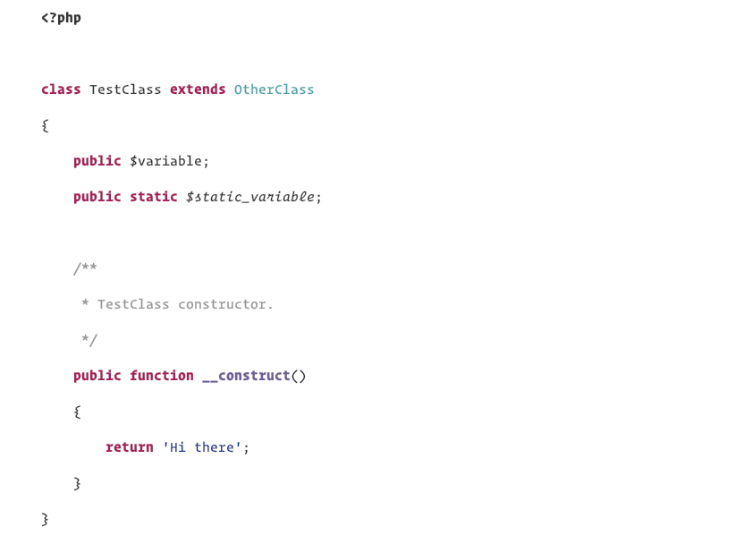

# Inspired Github theme for PHPStorm

A slightly edited version of [Github Remixed](https://github.com/panique/phpstorm-theme-github-remixed).

Colors based on the [Inspired Github theme](https://github.com/sethlopezme/InspiredGitHub.tmtheme) for Visual Studio Code.

Uses the Operator Mono font, and Menlo as a fallback.

## Installation

* Download the icls-file from this repository.
* Open PHPStorm.
* Go to 'Preferences' -> 'Editor' -> 'Color Scheme'.
* Click the wheel-icon and select 'Import Scheme...'.
* Select the 'Inspired Github.icls' and hit 'Apply'.

## Note
This was put together quickly. If you have any improvements, please feel contribute.